= Wu Wei（無為）利用ガイド
:doctype: book
:toc: left
:toclevels: 3
:sectnums:
:lang: ja

== Wu Wei（無為）の目的

Wu Wei（無為）は、無理に結論へ押し込めるのではなく、自然な思考の流れをそのまま残し、育てていくためのツールです。

調査や考察の過程では、最初から論点や結論が明確になっているとは限りません。資料を読み、気になる言葉に出会い、関連をたどり、別の資料とのつながりに気づきながら、少しずつ理解が形づくられていくことが多くあります。重要なのは、その時々に何に注目し、どのように考えが広がり、どのような関係を見いだしたのかという過程です。

しかし、通常のメモや資料一覧では、そのような自然な思考の流れを十分に残すことは簡単ではありません。あとで見返したときに、なぜその資料を残したのか、どの観点から重要だと考えたのか、自分がどのような道筋で考えていたのかが見えにくくなりがちです。

Wu Wei（無為）は、この問題に応えるために、資料をコンテンツとして置き、それを読み解くための観点をトピックとして置き、それらの関係を関連線として結びながら、思考の流れそのものを構造として残せるようにします。そこでは、ノートは単なる記録ではなく、考えを深め、見直し、他者にも引き継げる形で育てていくための場になります。

本マニュアルでは、Wu Wei（無為）を単なる情報整理ツールではなく、自然な思考の過程を残し、育てていくための調査ノート環境として捉え、その基本的な考え方と利用方法を説明します。

**何が書けるか**

Wu Wei（無為）には、資料そのものだけでなく、その資料をどう読み、何に注目し、どのようにつながりを見いだしたかを書き残すことができます。

たとえば、ウェブページ、PDF、画像、動画、電子化した書籍や文書などを、参照する資料として登録できます。これらは単なる保存対象ではなく、あとで見返し、比較し、考察に結びつけるためのコンテンツとして扱います。

また、それぞれの資料に対して、どのような観点で重要だと考えたのかを、トピックとして書くことができます。トピックには、キーワード、概念、人物、出来事、論点、仮説、疑問、補足メモなどを書けます。つまり、資料の内容そのものだけでなく、利用者がその資料から何を読み取ったのかも残せます。

さらに、コンテンツとトピック、あるいはトピック同士を関連線で結ぶことで、「この資料はこの論点に関係する」「この出来事はこの人物と関係する」「この仮説はこの資料によって支えられる」といった関係を書くことができます。これにより、個々の資料やメモがばらばらに存在するのではなく、考えのつながりを持った構造として残せます。

動画を扱う場合には、動画全体だけでなく、注目すべき場面を時間軸の上に切り出して書くこともできます。これにより、どの場面がどの観点で重要なのかを、時間の流れを保ったまま整理できます。

Wu Wei（無為）に書けるのは、完成した結論だけではありません。考え始めたばかりの問い、まだ確かでない仮説、比較の途中経過、あとで見直したい着想も書き残せます。そのため、Wu Wei（無為）は結果を記録するためだけでなく、考えている途中の状態をそのまま扱えるノートとして役立ちます。

**どう使うか**

Wu Wei（無為）は、最初から完成した図を作るために使うのではなく、資料を読みながら少しずつ考えを形にしていくために使います。

まず、調査の出発点になる資料をコンテンツとして置きます。最初の段階では、すべての資料を並べる必要はありません。まず重要だと思う資料や、考えるきっかけになる資料から始めます。

次に、その資料をどう読むかという観点をトピックとして置きます。たとえば、重要な用語、気になる人物名、中心となる論点、確かめたい仮説などをトピックにします。そして、その資料と観点を関連線で結びます。これによって、どの資料がどの観点に結びついているかが見えるようになります。

調査が進むにつれて、新しい資料を追加したり、トピックを分けたり、別の資料との関係を見つけたりします。そのたびに、Wu Wei（無為）のノートも更新していきます。最初に作った構造を固定するのではなく、理解が深まるのに合わせて育てていくことが大切です。

また、Wu Wei（無為）では、必要な部分だけを広げたり、いま注目したい部分だけに絞ったりしながら使います。これにより、全体を一度に見て混乱するのではなく、そのときの関心に応じて考察の焦点を動かせます。調査とは、すべてを最初から整理し切ることではなく、見つけた関係をたどりながら理解を深めていくことだからです。

動画を扱うときには、動画全体をひとつの資料として置くだけでなく、重要な場面を切り出して、その場面ごとにトピックと結びつけていきます。そうすることで、動画も文書資料と同じように比較や分析の対象として扱いやすくなります。

Wu Wei（無為）の使い方で大切なのは、きれいに整理することを急がないことです。最初は粗くてもかまいません。資料を置き、気になる観点を書き、関係をつなぎながら、少しずつ見直していくことで、自然な思考の流れをそのままノートとして育てていくことができます。

**Wu Wei（無為）は、資料を単に保存するためのツールではありません。**

Webページ、PDF、Office 文書、画像、動画、音声、メモなどをコンテンツとして配置し、それをどう読むか、どの観点で見るかをトピックや 付箋紙として記録し、それらの関係をリンクで結ぶことで、調査や思考の流れを構造として残すためのノート環境です。

Wu Wei（無為）で作成するノートは、完成した結論だけを記録するものではありません。
調査途中の仮説、気づき、比較、関連づけ、保留事項も含めて、後から見直せる形で残すことを目的とします。

== この文書について

この文書は、Wu Wei（無為）の利用方法を説明するガイドブックです。

Wu Wei（無為）を初めて使う利用者が、ホーム画面でリソースを探し、ノートにコンテンツとして追加し、トピック、付箋紙、リンク、グループ、時間軸で調査構造を作り、保存・公開するまでの流れを理解できるように構成します。

この文書では、操作説明とデータ概念を次の観点で整理します。

* Wu Wei（無為）の基本概念。
*ノート、ページ、コンテンツ、トピック、付箋紙、リンク、グループ、リソースの関係。
* ホーム画面からリソースを選び、ノートに追加する流れ。
* ヘッダーメニューごとの操作手順。
* 公開したノートの扱い。
* 表示、編集、保存、公開、閲覧専用モードの違い。

== 基本概念

=== ノート

ノートは Wu Wei（無為）の作業単位です。

ノートは複数のページを持ち、各ページにノード、リンク、グループ が配置されます。

ノートを単体ファイルとして受け渡しても再現しやすいように、ノート内には参照リソースのメタデータを保持しています。

=== ページ

ページは、ノート内の作業面です。

ページにはページID があり、ページ番号とは別です。
画面上のページ番号は、ノート内のページの並び順から決まる表示用番号です。
ページを追加、削除、コピーした場合、表示上のページ番号は変わる場合があります。

ページは次の情報を持ちます。

* ノード一覧
* リンク一覧
* グループ一覧
* 表示位置と拡大率
* ページサムネイル
* 監査情報

ページサムネイルは、右上の縮小図と同じ 200 x 200 の SVG として保存されます。
ページ一覧画面や左下のページ番号ホバー時のサムネイル表示では、このページサムネイルを利用します。

=== ノード

ノードはページ上に配置される要素です。

主なノード種別は次のとおりです。

* コンテンツ
* トピック
* 付箋紙
* 時間軸
* 映像セグメント

コンテンツは、リソースを参照するノードです。
トピックは観点、論点、分類、キーワードなどを表します。
付箋紙は自由記述のメモであり、Asciidoc、Markdown、plain text、HTML などの記述形式を持てます。

=== コンテンツとリソース

コンテンツは、ノート上に置かれる参照ノードです。
リソースは、コンテンツが参照する再利用可能なコンテンツ定義です。

コンテンツノードは、リソース定義を直接保持せず、`resourceRef` でノート内の `resources[]` にあるリソースを参照します。
同じリソースを複数のコンテンツノードから参照できます。

同じ PDF や Office 文書を参照していても、コンテンツごとに参照ページ、シート、時間範囲、fragment などを変えたい場合は、コンテンツ側の `resourceView` に保持します。

=== リンク

リンクは、ノード間の関係を表します。

リンクは単なる線ではなく、どの資料がどの観点に関係するか、どのトピックがどのトピックを補足または対比するかなど、思考上の関係を残すための要素です。

リンクには形状があり、NORMAL、HORIZONTAL、HORIZONTAL2、VERTICAL、VERTICAL2 などを利用できます。
HORIZONTAL2 と VERTICAL2 では、始点・終点だけでなく追加制御点を持ちます。

=== グループ

グループは複数のノードをまとめて扱うための要素です。

グループ種別は次のとおりです。

* 単純グループ(simple Group)
* 水平軸グループ(horizontal Group)
* 垂直軸グループ(vertical Group)
* 映像タイムライン(timeline Group)

グループは表示・非表示操作の単位にもなります。
グループのメンバーノード、またはグループの軸を非表示にする場合は、グループ全体を一括して非表示にします。
関連を展開(bloom)でメンバーノードが再表示される場合も、そのノードが属する グループ全体を再表示します。

映像タイムライングループも同じ一括表示・非表示規則に従います。

=== リソース

リソースは再利用可能なコンテンツ定義です。

リソースは大きく次の 2 種類に分けます。

* 外部Webリソース
* Uploadedリソース

外部 Webリソースは、Web page、blog、YouTube、Vimeo、団体サイト、公開PDFのURLなど、他者が公開している情報を参照します。
原則として実体ファイルはコピーせず、URI、metadata、embed 情報を保持します。

Uploadedリソースは、ユーザーがアップロードした PDF、Office 文書、text、video、audio、photo などです。
アップロード実体は、`data/{user_uuid}/upload/yyyy/mm/dd/{uploaded_file_uuid}/` に保存され、リソースはその相対パスを参照します。

リソースライブラリは次の場所に保存されます。

[source]
----
data/{user_uuid}/resource/yyyy/mm/dd/{resource_uuid}/resource.json
data/{user_uuid}/resource/yyyy/mm/dd/{resource_uuid}/thumbnail.*
data/{user_uuid}/resource/yyyy/mm/dd/{resource_uuid}/preview.*
----

ノート保存時には、ノート内で参照しているリソース定義のコピーをノートsnapshot 側にも保持します。

[source]
----
data/{user_uuid}/note/yyyy/mm/dd/{note_uuid}/resource/{resource_uuid}/resource.json
data/{user_uuid}/note/yyyy/mm/dd/{note_uuid}/resource/{resource_uuid}/original.*
data/{user_uuid}/note/yyyy/mm/dd/{note_uuid}/resource/{resource_uuid}/thumbnail.*
data/{user_uuid}/note/yyyy/mm/dd/{note_uuid}/resource/{resource_uuid}/preview.pdf
----

== 画面構成

=== ホーム画面

.ホーム画面
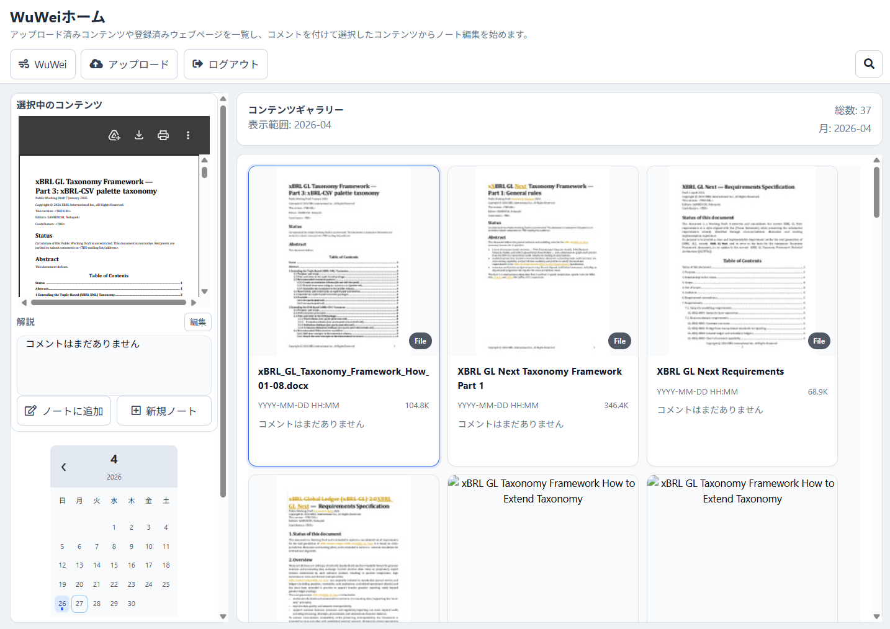

ホーム画面は、リソースライブラリに登録されたコンテンツを探し、ノートに追加するための画面です。

ホーム画面のギャラリーは、`data/{user_uuid}/resource/yyyy/mm/dd/{resource_uuid}/resource.json` を対象に表示します。
upload ディレクトリやテストデータを直接一覧対象にはしません。

ホーム画面では次の操作を行います。

* リソースを日付で探します。
* リソースをキーワードで探します。
* ギャラリーでリソースを選択します。
* 選択したリソースを左上の「選択中のコンテンツ」に表示します。
* 選択したリソースから新規ノートを作成します。
* 選択したリソースを編集中ノートに追加します。

ギャラリーの表示サイズは、情報ペイン幅を上限とする正方形です。
Webページ、YouTube、Vimeo などは、iframe 表示を基本とします。
サイト側が iframe 表示を拒否する場合は、その旨を表示し、必要に応じて新規タブで開きます。

=== ノート編集画面

ノート編集画面は、SVG 上にノードと リンクを描画する作業画面です。

.ノート編集画面
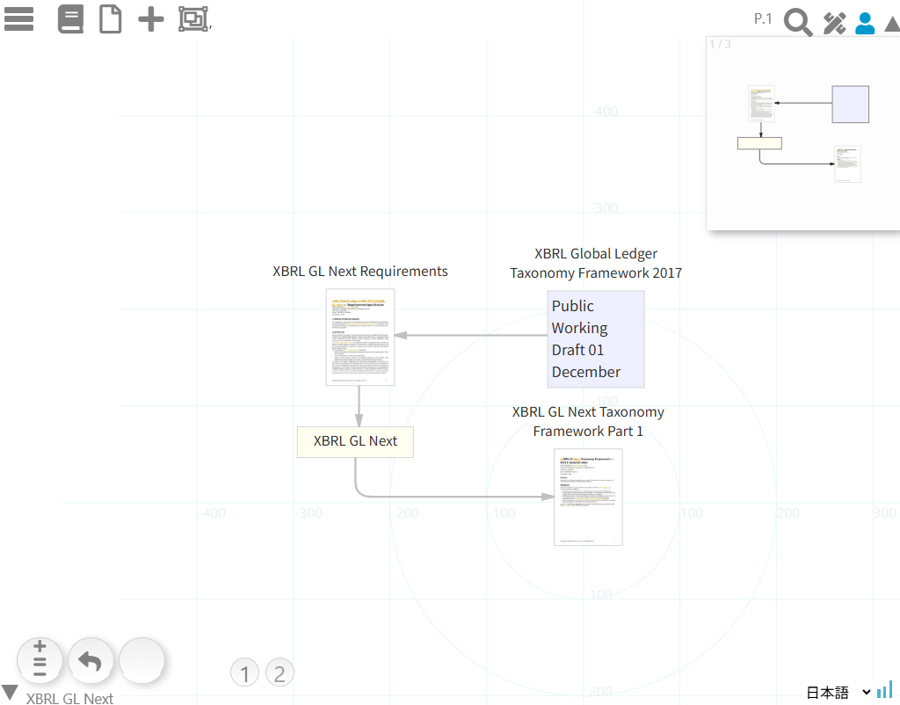

ノードの上にマウスを置くとコンテキストメニューが表示されます。
対象ノードまたはリンクに応じて、利用可能なコマンドだけが表示されます。

編集画面には次の主な補助表示があります。

* 右上の縮小図
* 左下のページ番号
* ページ番号ホバー時のページサムネイル
* 編集ペイン
* 情報ペイン

== ヘッダーメニュー操作マニュアル

ヘッダーメニューは画面左上に並ぶ主要操作入口です。

表示されるメニューや操作可能な項目は、ログイン状態、編集中かどうか、公開閲覧モードかどうかによって変わります。

=== ハンバーガーメニュー

ハンバーガーメニューは、画面全体の主要表示や ホーム画面との切り替えに使います。

主な用途は次のとおりです。

* ホーム画面を開きます。
* Wu Wei（無為）編集画面に戻ります。
* 画面全体の表示領域を切り替えます。

ホーム画面では、アップロード済みリソースや Webリソースを探してノートに追加します。
ノート編集画面では、ノードとリンクを配置して調査構造を作成します。

=== ノートメニュー

ノートメニューは、本のアイコンから開きます。

.ノートメニュー
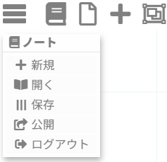

主な操作は次のとおりです。

==== 新規

新しいノートを作成します。

現在のノートに未保存変更がある場合は、必要に応じて保存してから実行します。
新規ノート作成後は、空のページが作成され、編集画面に表示されます。

==== 開く

保存済みノートの一覧を表示します。

ノート一覧では、ノートサムネイル、ノート名、更新日時、説明を確認できます。
ノートを選択すると、そのノートを読み込んで編集画面に表示します。

ノート一覧からノートを削除することもできます。
削除は保存済みノートに対する操作ですので、実行前に対象を確認します。

==== 保存

現在編集中のノートを保存します。

保存時には、ノート本体と、ノート内で参照しているリソース定義が保存されます。
現在ページの サムネイルもページデータに保持されます。

ノート保存では、コンテンツノードに展開された実行時用 `node.resource` は保存しません。
保存データでは、`resourceRef` と `resources[]` に戻します。

==== 公開

現在のノートを公開します。

公開成功後はモーダルメッセージを表示します。
モーダルには次の内容を表示します。

* 公開しました。
* 公開URL。
* 新規タブで開きます。
* URLをコピー。

「新規タブで開く」を押した場合だけ、公開URLを `window.open(publicUrl, '_blank', 'noopener')` で開きます。
自動では新規タブを開きません。

公開URLで開いたノートは、公開閲覧モードとして扱います。
公開閲覧モードでは、編集、保存、公開、ダウンロードを無効化します。

==== ログアウト

ログイン状態を解除します。

ログアウト後は、ログインが必要な保存、公開、アップロードなどの操作は利用できません。

=== ページメニュー

ページメニューは、ファイルアイコンから開きます。

.ページ操作メニュー
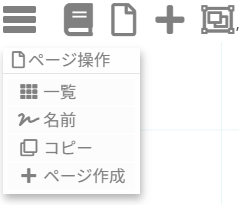

ページは、ノート内の作業面であり、複数のページを持てます。

==== 一覧

ページ一覧画面を表示します。

.ページ一覧画面
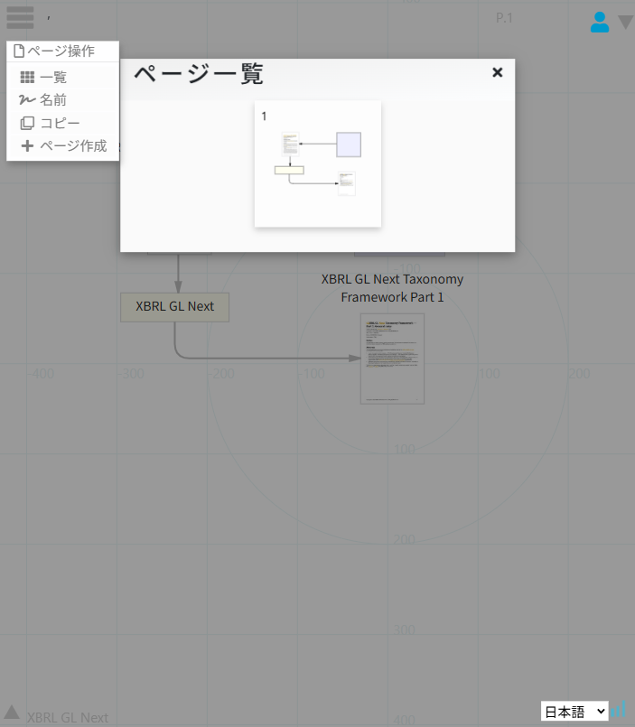

ページ一覧では各ページの サムネイルを確認できます。
サムネイルは右上の縮小図と同じ 200 x 200 の SVG として保存されたものを表示します。

ページ一覧画面には「ページ追加」ボタンがあります。
このボタンを押すと、白紙ページをノートの最終ページとして追加します。

==== 名前

現在編集中のページに名前と説明を設定します。

ページ名は画面上部のページ表示やページ一覧で利用されます。

==== コピー

現在編集中のページと同じ内容を持つページを、ノートの最終ページとして追加します。

コピー時には、ノードID、リンクID を新しく採番します。
リンクの接続先もコピー後のノードID に更新します。

==== ページ作成

白紙ページをノートの最終ページとして追加します。

ページ追加後、左下のページ番号が更新されます。
ページが 2 以上ある場合、左下にページ番号の円が表示され、クリックでページを切り替えられます。

=== 新規メニュー

新規メニューは、プラスアイコンから開きます。

.新規メニュー
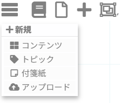

主な操作は次のとおりです。

==== コンテンツ

新しいコンテンツノードを作成します。

コンテンツは、リソースを参照するノードです。
URL、アップロード済みリソース、Webリソース、PDF、Office 文書、画像、動画などを扱います。

==== トピック

新しいトピックノードを作成します。

トピックは資料を読む観点、論点、分類、キーワード、仮説などを表します。

==== 付箋紙

新しい 付箋紙ノードを作成します。

付箋紙は説明、仮説、補足、未解決事項などを自由に書くために使います。
付箋紙の説明文は、format と body を持ち、Asciidoc、Markdown、plain text、HTML などで表現できます。

==== アップロード

ファイルをアップロードしてリソースとして登録します。

アップロードした実体ファイルは、upload 領域に保存されます。
リソースライブラリには、`resource.json`、thumbnail、preview などが登録されます。
ホーム画面のギャラリーは、このリソースライブラリを対象に表示します。

=== グループメニュー

グループメニューは、グループアイコンから開きます。

.グループメニュー
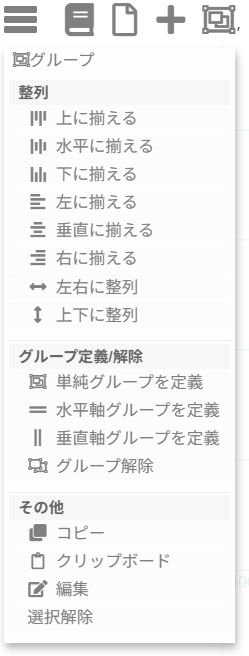

グループメニューは階層的に整理されています。

* 整列
* グループ定義/解除
* その他

==== 整列

選択中のノードを整列します。

利用できる操作は次のとおりです。

* 上に揃えます。
* 水平に揃えます。
* 下に揃えます。
* 左に揃えます。
* 垂直に揃えます。
* 右に揃えます。
* 左右に整列。
* 上下に整列。

==== グループ定義/解除

選択中のノードから グループを定義します。

利用できる操作は次のとおりです。

* 単純グループ(simple Group)を定義。
* 水平軸グループ(hirizontal Group)を定義。
* 垂直軸グループ(vertical Group)を定義。
* グループ解除。

単純グループはメンバー全体を囲みます。
水平軸グループと 垂直軸グループは軸を持ち、軸をドラッグして配置を調整できます。

==== その他

選択中ノードに対して、コピー、クリップボード、編集、選択解除などを行います。

=== 描画モード切替

描画モードアイコンでは、作業モードを切り替えます。

主なモードは次のとおりです。

* 作図(draw)モード
* 表示(view)モード
* シミュレーション(simulation)モード

作図(draw)モードでは、ノード、リンク、グループを編集できます。
表示(view)モードでは閲覧を中心とし、編集操作は制限されます。
シミュレーション(simulation)モードでは、力学モデルによってノード配置を動的に調整します。

シミュレーション(simulation)モードでは、グループの形状はできるだけ保持して描画を更新します。

=== 検索メニュー

検索アイコンから、ノート内の文字列検索を行います。

検索対象には、ノードの表示名、説明文、コンテンツの参照情報などが含まれます。
リソースライブラリ全体を検索する場合は、ホーム画面の検索を利用します。

=== ユーザー状態アイコン

ユーザーアイコンは、ログイン状態を示します。

ログインしている場合は、保存、公開、アップロードなどの操作が利用できます。
ログインしていない場合は、閲覧またはオフラインで可能な操作に制限されます。

== コンテキストメニュー操作

ノードまたはリンクにマウスを置くと、対象に応じたコンテキストメニューが表示されます。

=== コマンド

歯車アイコンから、対象に対する表示操作を行います。

.コンテキストメニュー コマンド
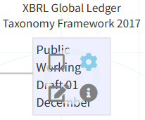 

主な操作は次のとおりです。

.コマンド
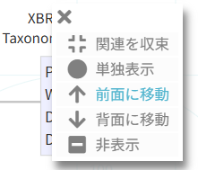

* 関連を収束(wilt)
* 単独表示(root)
* 関連を展開(bloom)
* 前面に移動(forward)
* 背面に移動(backward)
* 非表示(hide)
* ダウンロード

公開閲覧モードでは、ダウンロードは表示しません。

=== 編集

鉛筆アイコンから、対象に対する編集操作を行います。

.コンテキストメニュー 編集
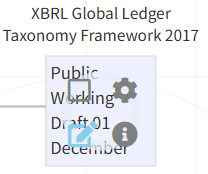 

主な操作は次のとおりです。

.編集
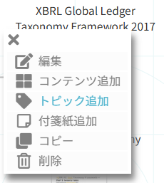

* 編集
* コンテンツ追加
* トピック追加
* 付箋紙追加
* コピー
* 削除

公開閲覧モードまたはviewモードでは、編集メニューは表示しません。

=== 情報

i アイコンから、対象の情報ペインを表示します。

.コンテキストメニュー 情報
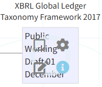 

コンテンツの情報ペインでは、リソースの種類に応じて表示方法を切り替えます。

.情報
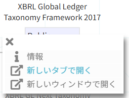

* PDFや文書は、previewまたはviewerで表示します。
* 画像は画像として表示します。
* YouTube、Vimeo、動画は、iframeまたはvideo viewerで表示します。
* Webページは、iframe表示を試みます。
* iframe表示が拒否された場合は、その旨とURLを表示します。

== 関連を収束(wilt) / 関連を展開(bloom) / 非表示(hide)

=== 関連を収束(wilt)

関連を収束(wilt)は、起点ノードからリンクをたどって関連ノードを折りたたむ操作です。

.コマンド 関連を収束(wilt)
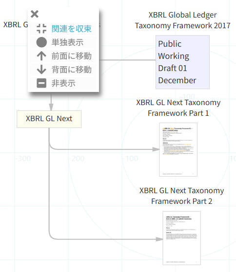 

.コマンド 関連を収束(wilt)の結果
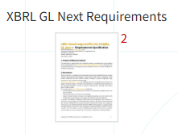 

たどった先のノードに、たどってきたリンク以外の表示対象リンクがない場合、そのノードとリンクを非表示にします。
この処理は再帰的に行います。

非表示になったリンクの数は、起点ノードの右上に未表示リンク数として表示します。

グループのメンバーノードが非表示になる場合は、その グループ全体を非表示にします。
このとき、メンバーノードに関連づけられたリンクも非表示にします。

=== 関連を展開(bloom)

関連を展開(bloom)は、非表示になっているリンクと、その先のノードを再表示する操作です。

.コマンド 関連を展開(bloom)
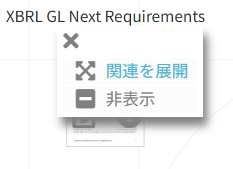 

.コマンド 関連を展開(bloom)の結果
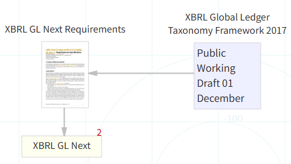 

関連を展開(bloom)は 関連を収束(wilt)と違い 1 段だけ開きます。
新しく開いたノードが グループのメンバーの場合は、その グループ全体を再表示します。

=== 非表示(hide)

非表示(hide)は、選択したノード、リンク、グループを直接非表示にする操作です。

非表示(hide)は削除ではありません。
必要になれば、リンクを経由した 関連を展開(bloom)などで再表示できる場合があります。

ただし、リンクと接続していない孤立ノードを 非表示(hide)した場合は、関連を展開(bloom)でたどれないため再表示できません。
孤立させたくないノードは、少なくとも 1 つのリンクで他のノードと関連づけておきます。

== 時間軸操作

動画リソースでは、映像タイムラインを作成できます。

映像タイムラインは動画全体を時間軸として扱い、重要な場面を 映像セグメントとして切り出すために使います。

基本的な流れは次のとおりです。

. 動画コンテンツを作成します。
. 情報ペインで動画を確認します。
. コンテキストメニューから 時間軸を作成します。
. 再生位置に基づいて 映像セグメントを追加します。
. 映像セグメントに 表示名、説明文、開始時刻、終了時刻を設定します。
. 映像セグメントをトピックや 付箋紙とリンクで結びます。

映像タイムライングループも グループの一種であり、表示・非表示は グループ全体で一括して扱います。

== 公開と公開閲覧モード

公開は、ノートを公開用URLで閲覧できるようにする操作です。

公開成功後、画面には公開URLを含むモーダルを表示します。

利用者は次の操作を選べます。

* 公開URLを確認します。
* 公開URLをコピーします。
* 公開URLを新規タブで開きます。

公開URLで開いたノートは、公開閲覧モードで表示します。

公開閲覧モードでは次の操作を無効化します。

* ノード、リンク、グループの編集。
* ノート保存。
* 公開。
* リソースをダウンロード。
* 新規ノード作成。
* ページ編集操作。

公開閲覧モードでは、読者がノートの構造、コンテンツ、トピック、付箋紙、リンク、ページを閲覧できることを優先します。

== ホーム画面からノートに追加する

ホーム画面では、登録済みリソースを探してノートに追加できます。

=== 新規ノート

「新規ノート」は、選択中リソースから新しいノートを作成します。

処理の流れは次のとおりです。

. 選択中リソースを確認します。
. 新しいノートを作成します。
. ノートの `resources[]` にリソース定義をコピーします。
. 初期ページにコンテンツノードを作成します。
. コンテンツノードの `resourceRef` にリソースID を設定します。

=== Add to note

「Add to note」は、選択中リソースを現在編集中のノートに追加します。

処理の流れは次のとおりです。

. 選択中リソースを確認します。
. 現在ノートの `resources[]` に同一リソースがあるか確認します。
. なければリソース定義をコピーします。
. あれば既存リソース定義を再利用します。
. 現在ページにコンテンツノードを作成します。
. コンテンツノードの `resourceRef` にリソースID を設定します。

同じリソースを参照するコンテンツノードは複数作成できます。
参照ページや時刻範囲などコンテンツごとの違いは `resourceView` に保持します。

== 保存と受け渡し

ノート保存時には、ノート本体の JSON が保存されます。

ノート本体は次の構造を持ちます。

[source,json]
----
{
  "note_id": "_note_uuid",
  "note_name": "note label",
  "description": "note description",
  "currentPage": "_page_uuid",
  "resources": [],
  "pages": [],
  "audit": {}
}
----

`resources[]` は、ノートが参照するリソース定義のコピーです。
`pages[]` は、ページの配列であり、ページ番号はこの配列の順序から決まります。

ノートをファイルとして受け渡す場合でも再現できるように、リソース metadata とページサムネイルをノート側に保持します。

== 利用上のポイント

=== 最初から完成形を目指さない

Wu Wei（無為）は完成図を最初に作るためのツールではありません。
まず中心となるリソースやトピックを置き、少しずつリンクを追加しながら構造を育てます。

=== リンクを意識する

ノードを置くだけでは、資料置き場になりやすくなります。
重要なのは、どのコンテンツがどのトピックに関係するのか、どのトピックがどのトピックを補足または対比するのかをリンクで表すことです。

=== 関連を収束(wilt)/ 非表示(hide)で焦点を絞る

調査が広がるほど、画面上の要素は増えます。
関連を収束(wilt)と非表示(hide)を使って、いま注目したい範囲だけを表示すると、ノートの構造が見えやすくなります。

=== 関連を展開(bloom)で必要な範囲を戻す

いったん折りたたんだ関係は、必要に応じて関連を展開(bloom)で戻します。
関連を展開(bloom)は 1 段ずつ開くため、関係を確認しながら表示範囲を広げられます。

=== 付箋紙を積極的に残す

付箋紙は完成した説明だけでなく、疑問、仮説、保留、気づきを残すためにも使います。
後から見返したとき、なぜそのリンクを作ったのか、なぜそのリソースに注目したのかを理解しやすくなります。

== まとめ

Wu Wei（無為）は、資料、観点、関係、途中の気づきを同じ作業面に残すための調査ノート環境です。

現在仕様では、リソースライブラリ、ホーム画面、ページサムネイル、グループ一括操作、時間軸、公開公開閲覧モードなどが統合されています。

基本的な使い方は次の流れです。

. ホーム画面または新規メニューからリソース/コンテンツを追加します。
. トピックや 付箋紙を置いて、読み方や観点を記録します。
. リンクでコンテンツ、トピック、付箋紙の関係を結びます。
. 必要に応じて グループや 時間軸を定義します。
. 関連を収束(wilt)、非表示(hide)、関連を展開(bloom)で表示範囲を調整します。
. ページを分けて調査の段階や観点を整理します。
. ノートを保存し、必要に応じて 公開します。

この流れにより、Wu Wei（無為）は単なる資料一覧ではなく、調査と思考の過程をたどれる構造化ノートとして機能します。
