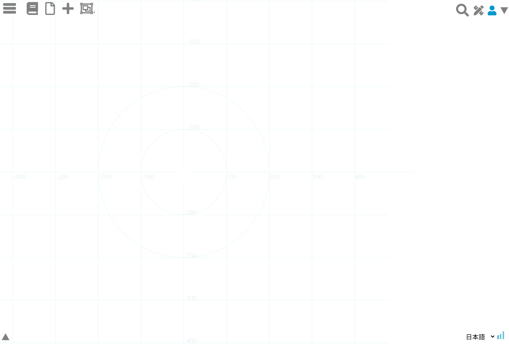
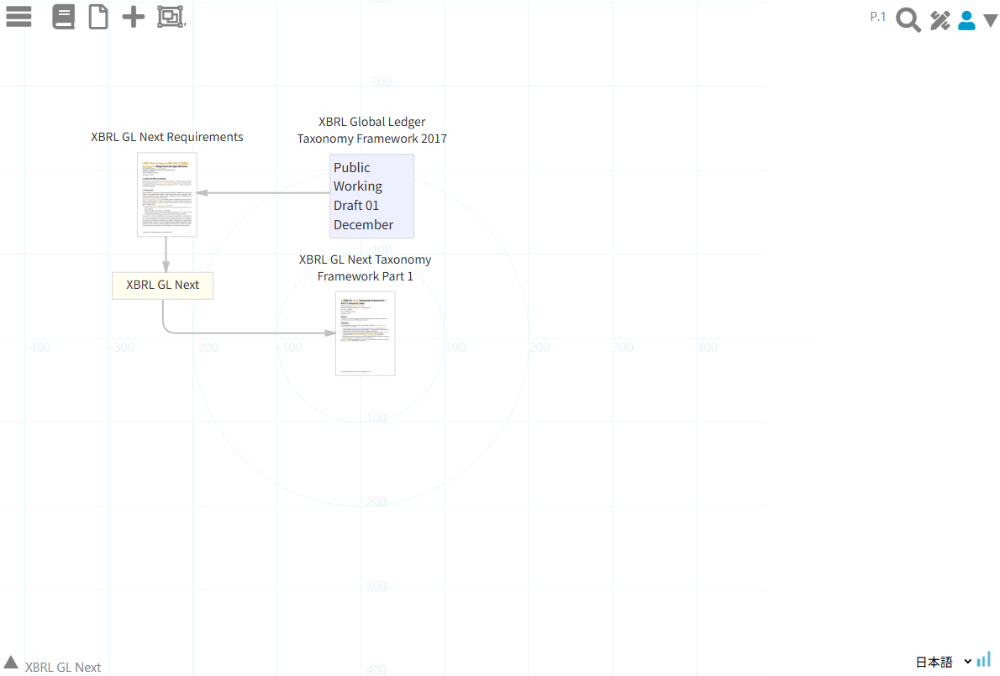
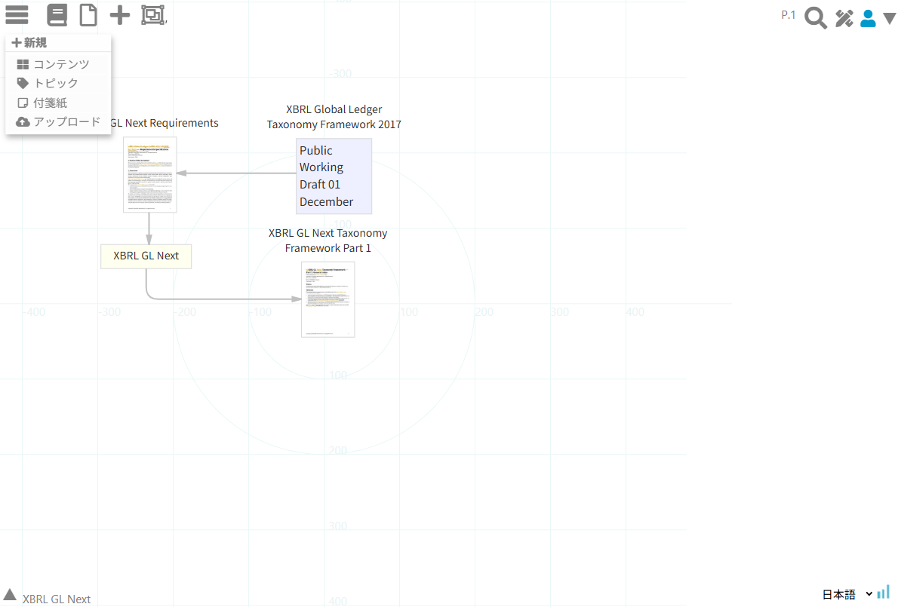
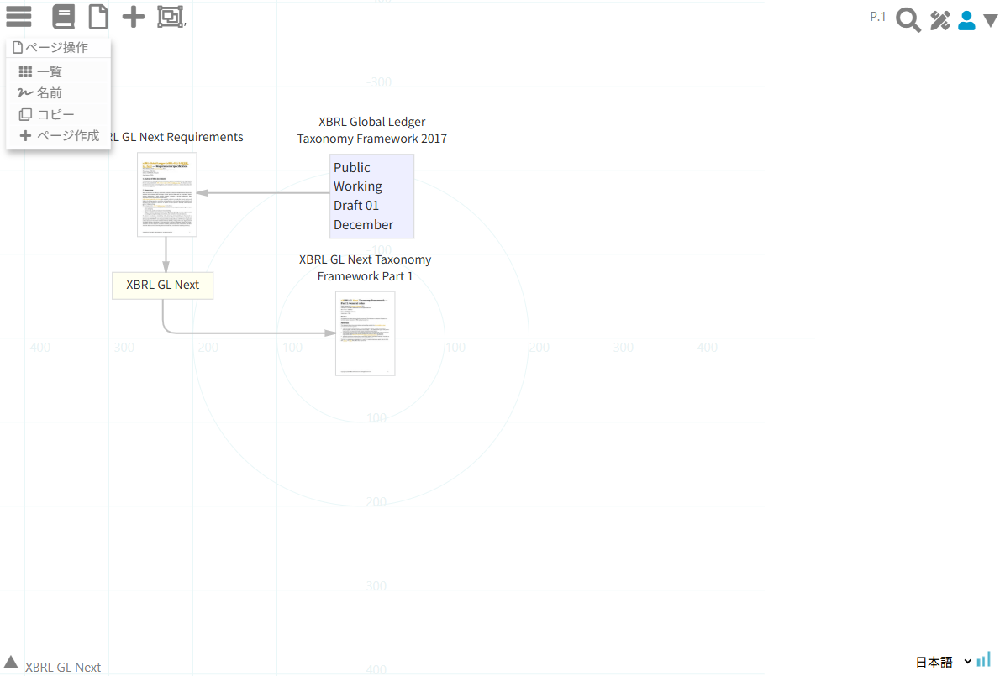
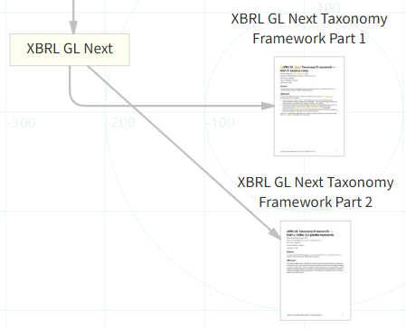
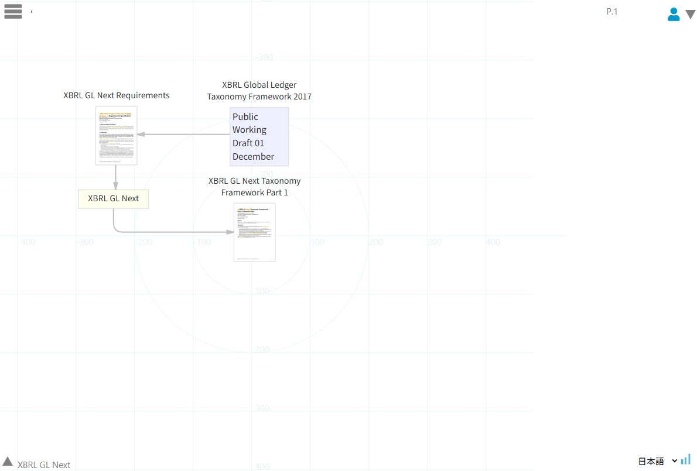
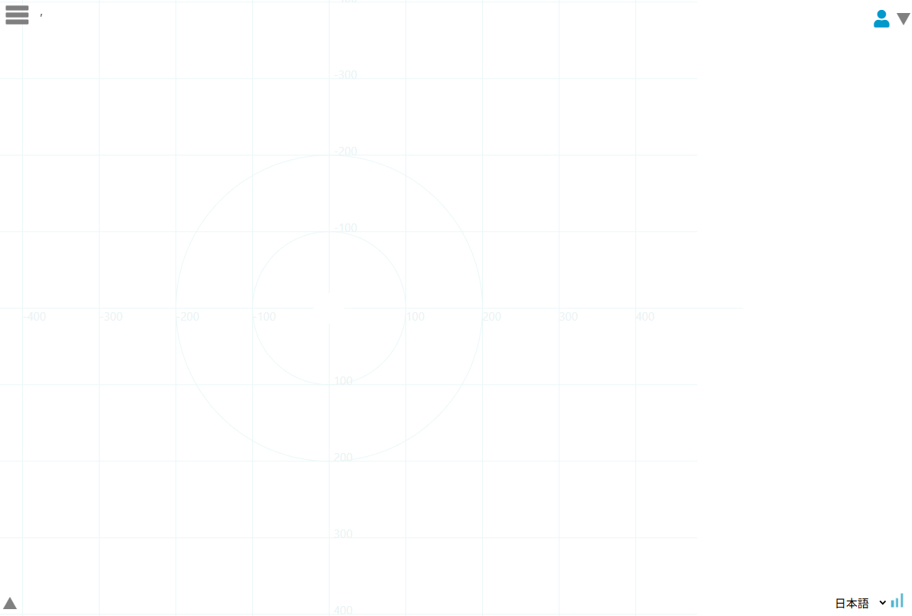

= WuWei ユーザーガイド
:doctype: article
:author: WuWei project
:sectnums:
:encoding: utf-8
:toc:
:toclevels: 3
:lang: ja
:revdate: 2026-05-21
:imagesdir: manual/user_guide

== この文書について

この文書は、WuWei を使ってノートを作成、編集、参照、export/import するための利用者向けガイドです。

WuWei は、Web ページ、PDF、Office 文書、画像、動画、音声、アップロード済みファイルなどをノートキャンバス上に配置し、トピック、メモ、ページ位置、時間位置、リンク、グループを使って、調査や思考の流れを記録するためのツールです。

最新仕様では、ノートの状態を次の 3 種類として扱います。

[cols="1,3", options="header"]
|===
|状態 |説明

|自分で作ったノート
|通常の個人ノートです。作成者本人が編集できます。

|他者から入手したノート
|export されたノートを import したものです。元の作成者が作った要素は保護し、利用者は補足説明や表示調整を中心に利用します。

|チームのノート
|共同編集用にチームへ公開されるノートです。チーム定義、共同編集者指定、revision 同期、operation log による反映を予定しています。現時点では仕様定義段階で、チーム定義画面/API は未実装です。
|===

== 画面の基本

=== ノートキャンバス

ノートキャンバスから、ノートの作成、既存ノートの読込、リソース登録、export/import などの操作を開始します。

.ノートキャンバス

ハンバーガーメニューを開くと、ノート操作、ページ操作、リソース操作などの主要機能にアクセスできます。

.ハンバーガーメニュー

=== ノートキャンバス

ノートキャンバスは、Content、Topic、Memo、PageMarker、Segment、Link、Group を配置する作業領域です。

.ノートキャンバス
image::img/canvas.png[ノートキャンバス, width=90%]

キャンバス上では、資料そのものだけでなく、資料から読み取った観点、仮説、注記、ページ位置、動画の時間位置、それらの関係を一緒に記録します。

== ノートを作る

=== 新しいノート

新規ノートは、メニューから作成します。ノート名と説明を入力し、必要に応じてページを追加しながら作業します。

.新規ノートメニュー

ノートには次の情報が保存されます。

* `note_id`: ノートを識別する ID
* `note_name`: ノート名
* `description`: ノート全体の説明
* `pages`: ページごとのキャンバス情報
* `resources`: 参照または同梱されるリソース情報
* `collabNoteState`: `own`、`imported`、`team` のいずれか
* `note_scope`: `personal` または `team`
* `team_id`: チームノートの場合のチーム ID

チーム ID を新規発行する場合は、仕様上 `"t-" + uuid.v4()` 形式を使います。

[source,text]
----
t-5c1f594a-315b-4bab-9075-62b1bebed7eb
----

=== ページ

ノートは複数ページを持てます。ページ一覧、ページ追加、ページ切替はページメニューから操作します。

.ページメニュー

.ページ一覧
image::images/wuwei_page_list.png[ページ一覧, width=90%]

ページには、ノード、リンク、グループ、表示位置、拡大率、ページサムネイルが保存されます。

== ノードの種類

=== Content

Content は、資料やメディアを参照するノードです。PDF、Office 文書、画像、Web ページ、動画、音声、アップロード済みファイルなどを扱います。

Content は、ファイル実体そのものだけでなく、次のような resource 情報を持ちます。

* `source`: `upload`、`remote` など
* `kind`: `document`、`image`、`webpage`、`video` など
* `uri`: 参照先 URI
* `thumbnailUri`: 表示用サムネイル
* `storage`: original や thumbnail の保存場所
* `viewer`: 情報ペイン、新規タブ、ダウンロードなどの表示方法

アップロード済み資料を export する場合、参照されている original と thumbnail のファイル実体も zip に同梱する必要があります。Web 上のリモート資料は、原則として URL とメタデータを保持し、必要に応じてサムネイル画像を同梱します。

=== Topic

Topic は、資料を読む観点、キーワード、概念、論点、人物、出来事、仮説などを表すノードです。

Topic を Content や Memo とリンクすることで、「どの資料が、どの観点に関係するか」を記録できます。

=== Memo

Memo は自由記述の注記です。説明、仮説、確認事項、引用の要約、未解決の疑問などを記録します。

Memo は `label` を持ちません。キャンバスに表示される本文は `description.body` です。

Memo の説明には markup 種類を指定できます。

[cols="1,3", options="header"]
|===
|Markup |説明

|`plain/text`
|プレーンテキストとして表示します。

|`asciidoc`
|AsciiDoc として整形表示します。

|`markdown`
|Markdown として整形表示します。

|`html`
|危険なタグやイベント属性を除去した上で HTML として表示します。

|`tex`
|現時点ではプレーンテキスト相当として扱います。将来、KaTeX または MathJax による数式表示を検討します。

|`other`
|未分類の形式です。現時点ではプレーンテキスト相当として扱います。
|===

=== PageMarker

PageMarker は、PDF や Office preview PDF の特定ページを示すノードです。

文書全体を Content として置き、その中の重要ページを PageMarker として切り出すことで、ページ単位の読解や比較ができます。

=== Segment

Segment は、動画や音声の時間区間を示すノードです。

動画全体を Content として置き、重要な場面を Segment として切り出すことで、時間軸に沿った分析ができます。

== リンクとグループ

=== Link

Link は、ノード間の関係を表します。資料とトピック、トピックとメモ、ページ位置と論点、動画区間とコメントなどを結びます。

.リンク作成

Link は単なる線ではなく、読解上の関係、補足、比較、根拠、参照などを記録する要素です。

=== Group

Group は、複数のノードをまとめるための領域です。調査単位、テーマ単位、時間軸、文書目次などを表すときに使います。

.グループ操作
image::img/group.png[グループ操作, width=20%]

Timeline axis と Contents axis も、内部的には group 情報を使って扱います。

== 情報ペインと編集ペイン

=== 情報ペイン

情報ペインでは、選択中のノードの label（Memo を除く）、description、resource、storage、viewer、audit などを確認します。

.情報ペイン
image::img/info1.png[情報ペイン, width=30%]

他者から import したノートでは、情報ペインに次の 2 種類の説明を分けて表示します。

* 元の description
* 自分が追加した description

元の description は、元ノートの意味を保護するため、原則として直接編集しません。

=== 編集ペイン

編集ペインでは、ノードの label（Memo を除く）、description、表示形式、幅、高さ、色、リンク先、リソース情報などを編集します。

.編集ペイン

自分で作ったノートでは、通常どおり description と markup 種類を編集できます。

他者から import したノートでは、元の description は read only として表示し、追加用 description textbox に自分の補足を記入します。追加用 description でも markup 種類を選択できます。

== 表示制御

コンテキストメニューから、選択ノードや関連ノードの表示を制御できます。

.コンテキストメニュー

主な表示制御は次のとおりです。

[cols="1,3", options="header"]
|===
|操作 |説明

|`wilt`
|関連範囲を弱く表示し、注目対象を絞ります。

|`bloom`
|弱く表示した範囲を再表示します。

|`hide`
|対象を非表示にします。

|`lower`
|表示上の重なり順を下げます。

|`upper`
|表示上の重なり順を上げます。

|`root`
|対象を表示上の基点として扱います。
|===

閲覧利用者であっても、これらの表示制御と view/simulation モードは利用可能です。ただし編集不可モードでは、ノート内容そのものは変更できません。

.wilt 操作前
image::img/wilt1.png[wilt 操作前, width=70%]

.wilt 操作後
image::img/wilt2.png[wilt 操作後, width=30%]

.bloom 操作前
image::img/bloom1.png[bloom 操作前, width=30%]

.bloom 操作後
image::img/bloom2.png[bloom 操作後, width=70%]

== ノートの保存と読込

=== 保存

ノートを保存すると、ページごとの nodes、links、groups、resources、thumbnail、audit 情報が保存されます。

自分のノートは個人領域に保存されます。

[source,text]
----
data/{user_uuid}/note/YYYY/MM/DD/{note_uuid}/note.json
----

チームノートは、将来の共同編集機能でチーム領域に保存します。

[source,text]
----
data/{team_id}/YYYY/MM/DD/{note_uuid}/section/*
----

=== 読込

ノート読込時には、保存データから `collabNoteState` を判断します。

[cols="1,3", options="header"]
|===
|状態 |読込後の扱い

|`own`
|自分で作った個人ノートとして編集できます。

|`imported`
|他者から入手したノートとして扱います。元の要素は保護し、補足 description や表示調整を中心に利用します。

|`team`
|チームノートとして扱います。共同編集者、権限、revision、operation log に基づく制御を行う予定です。
|===

== Export / Import

=== Export

Export は、ノートと関連リソースを zip ファイルにまとめる機能です。

Export zip には次の内容を含めます。

* `export-manifest.json`
* `note/` 配下のノート JSON
* `upload/` と `resource/` 配下の同梱対象ファイル

アップロード済みコンテンツでは、original と thumbnail のファイル実体を同梱します。リモート Web コンテンツでは、URL を保持し、ローカルに保持しているサムネイル画像がある場合は同梱対象にします。

処理に時間がかかるため、export 実行中は完了までモーダルメッセージを表示します。

=== Import

Import は、export zip を読み込み、ローカル環境またはサーバー環境の `data/` 領域へ展開する機能です。

Import 後は、ノートを `collabNoteState: "imported"` として扱います。

Import 処理では次を確認します。

* note JSON が展開されていること
* upload content が `content/` または該当領域に復元されていること
* thumbnail が `thumbnail/` または note JSON 内の参照先と一致する場所に復元されていること
* note JSON 内の `thumbnailUri` と実ファイルの場所が一致していること

処理に時間がかかるため、import 実行中も完了までモーダルメッセージを表示します。

== 他者から入手したノートの利用

他者から入手したノートは、自分の環境で読めますが、元の作成者が作った内容は保護します。

利用者ができること:

* ノートを閲覧する
* 表示位置や view 操作で内容を確認する
* 元の description を読む
* 追加 description に自分の補足を記録する
* 自分が追加した補足を編集する

原則として制限されること:

* 元の作成者が作った node/link/group の意味内容を直接変更する
* 元の description を上書きする
* 元の作成者の audit 情報を変更する

追加 description は、元の description とは別 entry として保存します。

[source,json]
----
[
  {
    "role": "original",
    "body": "元の説明",
    "format": "asciidoc"
  },
  {
    "role": "supplement",
    "body": "受領者による補足説明",
    "format": "markdown"
  }
]
----

== 公開と閲覧

ノートは、将来の公開機能で次の範囲へ公開できるようにします。

[cols="1,3", options="header"]
|===
|公開範囲 |説明

|特定個人
|指定した利用者だけが閲覧できます。

|特定グループ
|指定したチームまたはグループに属する利用者が閲覧できます。

|無制限
|閲覧可能な利用者全体に公開します。
|===

閲覧利用者は、ノートを作成しない利用形態です。チーム管理者またはシステム管理者が許可した場合、閲覧利用者も共同作業ノートを閲覧できます。

閲覧権限がないノートも一覧上で存在を確認し、閲覧申請できる画面を将来提供します。

== チーム共同作業

チーム共同作業では、作者が作成中のノートを指定チーム内で共有し、指定ユーザとの共同作業を宣言することで共同編集ノートを定義します。

必要になる画面:

* チーム定義画面
* チームメンバー管理画面
* ノート公開範囲指定画面
* 共同編集者指定画面
* 権限確認画面
* ノート一覧の公開状態・申請状態表示

現時点では、これらのチーム定義プログラムは未実装です。仕様上は `team_id` を `"t-" + uuid.v4()` 形式で生成します。

=== 共同編集時の基本ルール

共同編集ノートでは、自分が作成した描画や補足を編集できます。他者が作成した要素は、原則として read only とします。

自分の描画については undo/redo できます。自分がリンクしていた他者ノードが削除された場合、そのリンクは soft delete として削除扱いにします。

=== Revision と operation log

共同編集では、サーバー側の latest revision と、クライアントが保持している baseRevision を比較します。

クライアントは、前回サーバーへ反映した時点の latestRevision を baseRevision として保持します。次回送信時には、その baseRevision から現在状態までの差分を changes として送ります。

サーバー側で revision が進んでいる場合、サーバーは `staleRevision` を返し、baseRevision から latestRevision までの変更内容を返します。クライアントはそれを取り込んだ上で、自分の変更を再適用または再送します。

ローカルの `wuwei.log` は、operation log の元データとして利用できます。ただし、そのまま送るのではなく、送信時点の差分として整理します。

例えば、次の操作は送信時点では差分なしとして扱えます。

[source,text]
----
ノードを作る
すぐ削除する
----

サーバー時刻に補正したタイムスタンプは、同期順序の決定ではなく、デバッグ用に付与します。実際の同期判定は revision と changes を中心に行います。

== 検索とタグ

ノートの description には `#タグ` を定義できます。

使用可能なタグは、チーム管理者またはシステム管理者が管理します。ノート一覧では、キーワード検索とタグ検索を提供する予定です。タグクラウドの提供も検討対象です。

== 利用時の確認ポイント

Export / Import 後に参照が壊れている場合は、次を確認します。

* note JSON 内の `uri`、`thumbnailUri`、`storage.files[].path`
* `upload/YYYY/MM/...` に original ファイルが存在すること
* `upload/YYYY/MM/.../thumbnail.jpg` または note JSON が指す場所にサムネイルが存在すること
* リモート Web コンテンツの場合、URL とローカルサムネイルの役割が混同されていないこと
* zip 内に `upload/` と `resource/` があり、必要なファイルが含まれていること

Import 後のノートで画像アイコンだけが表示される場合、多くは `thumbnailUri` が指すファイルがサーバー上に存在しない、または export 時に同梱されていないことが原因です。

== 付録: 現在の実装状況

[cols="1,2,2", options="header"]
|===
|項目 |状態 |補足

|個人ノート作成・編集
|実装済み
|通常の `own` ノートとして利用します。

|Export / Import
|実装済み、改訂中
|resources 同梱、サムネイル復元、処理中モーダル表示を含みます。

|Import ノートの保護編集
|実装済み
|元 description は read only、追加 description を別 entry として扱います。

|Markup 選択
|実装済み
|`plain/text`、`asciidoc`、`markdown`、`html`、`tex`、`other` を扱います。TeX は将来拡張です。

|チーム定義
|未実装
|仕様上は `team_id = "t-" + uuid.v4()` です。

|チーム共同編集
|設計中
|revision、operation log、権限制御を段階的に実装します。

|公開・閲覧申請
|設計中
|特定個人、特定グループ、無制限公開を予定します。
|===
