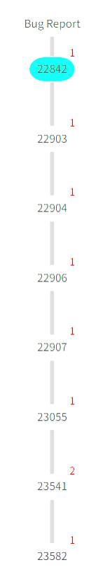
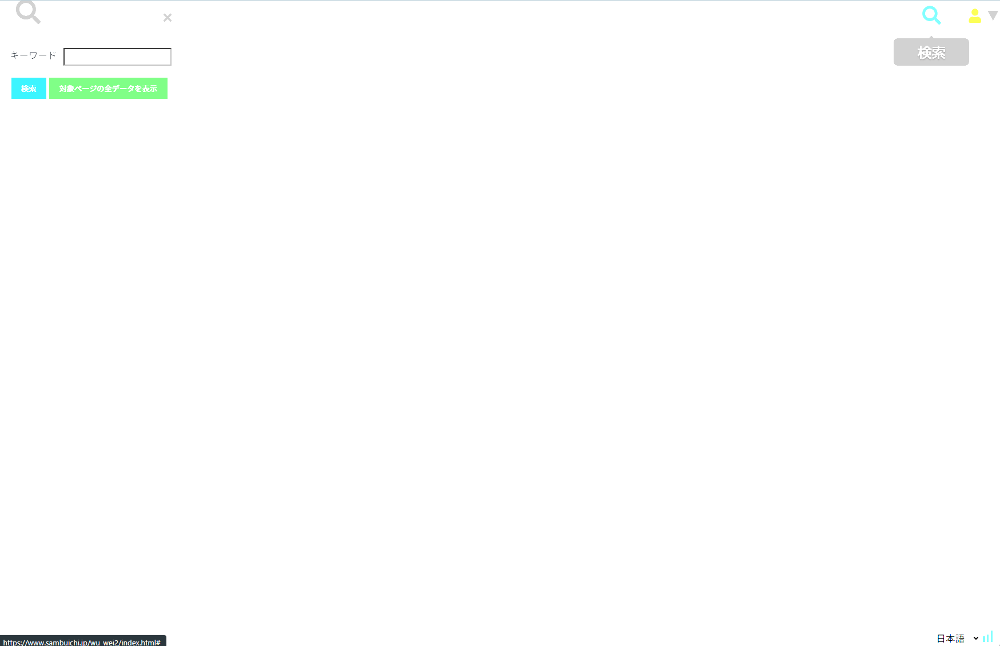

= WuWei 公開ノート利用者マニュアル
三分一信之（三分一技術士事務所）
:revnumber: ver 1.0
:revdate: 2026-05-28
:revremark:
:version-label!:
:doctype: book
:toc:
:toclevels: 3
:sectnums:

== この文書について

この文書は、WuWei の公開ノートを閲覧する利用者向けのマニュアルです。

公開ノートは、作成者が公開したノートを他の利用者が参照するための画面です。閲覧者はノートの内容を確認し、関連資料を開き、表示範囲を一時的に切り替えることができます。一方で、公開ノートは編集不可です。ノード、リンク、グループ、説明文、リソース情報など、ノートに保存される内容は変更できません。

このマニュアルでは、公開ノートの読み方、情報ペイン、コンテキストメニュー、表示制御、リンク先の開き方を説明します。

== 公開ノートでできること / できないこと

[cols="1,3", options="header"]
|===
|区分 |内容

|できること
|ノートを閲覧する、キャンバスを移動・拡大縮小する、情報ペインを開く、関連ページを新しいタブまたはウィンドウで開く、表示制御を一時的に使う。

|できないこと
|ノードやリンクを編集する、説明文を書き換える、ノードを追加・削除する、リンクを追加・削除する、グループを定義・解除する、ノートを保存する。

|表示だけ変わる操作
|`Bloom`、`Wilt`、`Root`、`Hide` などの表示制御は、閲覧中の画面表示だけを変えます。公開ノート本体は保存されません。

|外部ページの表示
|ログインが必要なページ、またはサイト側で iframe 表示を禁止しているページは、情報ペイン内に直接表示できないことがあります。その場合は、新しいタブまたはウィンドウで開いてください。
|===

== 画面の基本

公開ノートを開くと、ノートキャンバスが表示されます。

.ノートキャンバス
image::images/wuwei_home_screen.png[ノートキャンバス, width=90%]

キャンバス上には、次のような要素が配置されます。

[cols="1,3", options="header"]
|===
|要素 |説明

|Content
|Web ページ、PDF、Office 文書、画像、動画、音声、アップロード済みファイルなどを表すノードです。サムネイル画像やタイトルが表示されます。

|Topic
|話題、論点、分類などを表すノードです。

|Memo
|作成者が書いたメモです。

|Link
|ノード同士の関係を表す線です。

|Group
|複数のノードをまとめた表示単位です。水平軸、垂直軸、単純グループなどがあります。
|===

== キャンバス操作

=== 移動と拡大縮小

キャンバスは、マウスやトラックパッドで移動・拡大縮小できます。表示位置の変更は閲覧中の操作であり、公開ノート本体には保存されません。

=== ノードの選択

ノードにカーソルを置くと、ノードの周辺にコンテキストメニューのアイコンが表示されます。

image::img/command1.png[コンテキストメニュー, width=30%]

表示される主なアイコンは次のとおりです。

[cols="1,3", options="header"]
|===
|アイコン |説明

|歯車
|表示制御などのコマンドメニューを開きます。

|鉛筆
|編集メニューです。公開ノートでは編集不可のため、原則として使用しません。

|情報
|情報ペインを開き、ノードや関連リソースの情報を確認します。
|===

公開ノートでは、情報ペイン右上の鉛筆アイコンは表示されません。編集できるノートを開いた場合だけ表示されます。

== 情報ペイン

情報アイコンを選ぶと、画面右側に情報ペインが表示されます。

image::img/info2.png[コンテキスト情報メニュー, width=30%]

.情報ペイン

image::img/info_pane.png[情報ペイン, width=90%]

情報ペインでは、選択したノードについて次の情報を確認できます。

* タイトル
* 説明
* リソース種別
* URL
* サムネイル
* 関連ファイルやビューア情報
* 作成者・更新者などの管理情報

公開ノートでは、情報ペインは参照専用です。内容を書き換えることはできません。

=== HTML / Web ページの表示

HTML コンテンツや Web ページは、情報ペイン内でプレビューできる場合があります。

ただし、次の場合は iframe 内に表示されません。

* ログインが必要なページ
* サイト側が iframe 表示を禁止しているページ
* ブラウザやセキュリティ設定で埋め込み表示が制限されているページ

この場合、情報ペインには理由を示すメッセージと、外部で開くための操作が表示されます。

=== 新しいタブ / ウィンドウで開く

情報ペイン下部またはコンテキストメニューから、関連ページを新しいタブまたは新しいウィンドウで開けます。

[cols="1,3", options="header"]
|===
|操作 |説明

|新しいタブで開く
|現在のブラウザに新しいタブを作り、対象ページを開きます。

|新しいウィンドウで開く
|別ウィンドウで対象ページを開きます。複数資料を並べて読むときに便利です。
|===

ブラウザのポップアップブロック設定によっては、新しいウィンドウが開かないことがあります。その場合は、ブラウザ側で WuWei のポップアップを許可してください。

== コンテキストメニュー

ノードの周辺に表示される歯車アイコンを選ぶと、コマンドメニューが開きます。

.コンテキストメニュー
image::img/wilt1.png[コンテキストメニュー, width=60%]

公開ノートで利用する主なコマンドは、表示制御です。

[cols="1,3", options="header"]
|===
|コマンド |説明

|Wilt
|選択したノードにつながる一部のノードやグループを非表示にして、表示を整理します。

|Root
|選択したノードを中心に表示します。特定の論点や資料だけを見たいときに使います。

|Hide
|選択したノードを一時的に非表示にします。

|Bloom
|現在表示されていない接続先ノードを展開します。関連ノードをたどるときに使います。

|Show Group
|非表示になっているグループのメンバーを表示します。
|===

これらの操作は、表示を一時的に変えるだけです。公開ノートの保存内容は変更されません。ブラウザを再読み込みすると、公開された元の状態に戻ります。

== リンクと関連ノードの読み方

Link は、資料、論点、メモなどの関係を表します。

ノード間の線をたどることで、次のような関係を読み取れます。

* ある資料がどの論点に関係しているか
* ある問題に対して、どの資料やメモが紐づいているか
* あるグループが、どのノードをまとめているか

公開ノートでは、リンクの作成や削除はできません。リンクの向きや形も変更できません。

== グループの読み方

Group は、複数のノードをまとめるための表示単位です。

[cols="1,3", options="header"]
|===
|種類 |説明

|単純グループ
|複数ノードを枠や代表ノードでまとめます。

|水平軸グループ
|ノードを水平軸に沿って並べ、順序や分類を表します。

|垂直軸グループ
|ノードを垂直軸に沿って並べ、階層や段階を表します。

|Timeline / Viewpoint 系のグループ
|動画や文書の特定位置、ページ、観点などを整理するための特殊なグループです。
|===

公開ノートでは、グループの構成や配置は変更できません。表示制御によって、一時的に隠したり再表示したりできます。

== 検索

検索アイコンを使うと、ノート内または関連データを検索できます。

検索結果は、ノート上の該当ノードを見つけるために使います。検索しても公開ノートの内容は変更されません。

== ユーザ表示

画面右上のユーザアイコンにカーソルを置くと、現在のユーザ名が表示されます。

ユーザメニューでは、ログインユーザ情報を確認できます。公開ノートの閲覧では、ユーザの権限に応じて表示できるノートや操作が制限されます。

== まとめ

公開ノートは、作成者が整理した資料、論点、メモ、リンク、グループを閲覧するための読み取り専用画面です。

閲覧者は、情報ペインで詳細を確認し、必要な外部資料をタブまたはウィンドウで開き、`Bloom`、`Wilt`、`Root` などで表示を一時的に切り替えながら内容を読み進めます。

編集、保存、ノード追加、リンク変更、グループ変更は公開ノートでは行いません。
